# ⚡ AI-Driven Energy Supply Chain Resilience System

> Turning reactive crisis response into anticipatory, managed resilience for India's crude oil supply chain.


---

## 🌍 The Problem

India imports **88% of its crude oil**. Of that, **40–45% transits the Strait of Hormuz** — one of the most geopolitically volatile chokepoints on the planet.

| Metric | Reality |
|--------|---------|
| Strategic Petroleum Reserve cover | **~9.5 days** of national consumption |
| Brent crude spike during 2025 US-Iran standoff | **+8% in a single session** |
| Average extra stabilisation time without AI rerouting | **+47 days** (McKinsey) |
| Indian refineries dependent on Gulf crude | Reliance, HPCL, BPCL, MRPL, IOC |

Traditional supply chain tools were built for predictable environments. They cannot model geopolitical shocks in real time, evaluate alternative procurement corridors dynamically, or orchestrate coordinated response across refiners, logistics, and reserves.

**This system builds that intelligence layer.**

---

## 🎯 What This System Does

```
Geopolitical signal detected
        ↓  (< 2 hours)
Risk scored per corridor
        ↓
Scenarios modelled with cascading economic impact
        ↓
Alternative procurement routes ranked and surfaced
        ↓
SPR drawdown schedule optimised
        ↓
Policymakers and procurement teams act — not react
```
<br>
<br>
<p align="center">
  
</p>
<br>
<p align="center">
  
  
</p>

<br>
<br>
---

## 🏗️ System Architecture

```mermaid
graph TD
    subgraph INGEST["📡 Data Ingestion Layer"]
        A1[NewsAPI\nGeopolitical signals]
        A2[MarineTraffic\nAIS vessel data]
        A3[Alpha Vantage\nCommodity prices]
        A4[OFAC / UN\nSanctions registries]
        A5[Internal ERP\nRefinery demand]
        A6[MoPNG\nSPR stock levels]
    end

    subgraph MEMORY["🧠 Knowledge & Memory Layer"]
        B1[Supabase pgvector\nRAG over intel docs]
        B2[Neo4j\nSupplier → Route → Risk → Refinery graph]
        B3[Scenario Store\nMonte Carlo + historical shocks]
    end

    subgraph ORCH["🔀 Orchestration Layer"]
        C1[Multi-Agent Orchestrator\nLangGraph + CrewAI]
    end

    subgraph AGENTS["🤖 AI Agent Layer — Gemini 1.5 Flash"]
        D1[🌐 Geopolitical\nRisk Agent]
        D2[📊 Scenario\nModeller]
        D3[🛢️ Procurement\nOrchestrator]
        D4[🏭 SPR\nOptimiser]
        D5[🗺️ Digital Twin\nGeospatial Sim]
    end

    subgraph BACKEND["🗄️ Backend — Supabase"]
        E1[PostgreSQL\nAll structured data]
        E2[Realtime\nWebSocket alerts]
        E3[Edge Functions\nAPI handlers]
        E4[Auth\nUser management]
    end

    subgraph FRONTEND["💻 Frontend — React + Vite + TypeScript"]
        F1[Live Risk Heatmap\nLeaflet + AIS overlays]
        F2[Scenario Dashboard\nWaterfall charts]
        F3[Procurement Cards\nRanked recommendations]
        F4[SPR Timeline\nDrawdown visualiser]
        F5[Alert Feed\nReal-time ticker]
        F6[Response Tracker\nSignal → rec. latency]
    end

    subgraph OUTPUT["📋 Decision Outputs"]
        G1[Policymakers\nSPR / emergency decisions]
        G2[Procurement Teams\nSpot market orders]
        G3[Refinery Operators\nGrade substitution plans]
    end

    INGEST --> MEMORY
    MEMORY --> ORCH
    ORCH --> AGENTS
    AGENTS --> BACKEND
    BACKEND --> FRONTEND
    FRONTEND --> OUTPUT
```



---

## 🤖 The Five AI Agents

### 1. 🌐 Geopolitical Risk Intelligence Agent
Monitors news feeds, sanctions registries, and AIS vessel data to produce a **live disruption probability score (0–100)** per shipping corridor — updated continuously, not weekly.

**Corridors monitored:**
- Strait of Hormuz (Iran–Oman)
- Red Sea / Bab-el-Mandeb (Houthi threat zone)
- Suez Canal (Egypt)
- Cape of Good Hope (alternate route)
- Strait of Malacca (Asia Pacific)

---

### 2. 📊 Disruption Scenario Modeller
Simulates specific disruption events and computes **cascading economic impacts** with explicit, testable assumptions.

**Scenarios supported:**
| Event | Modelled Impact |
|-------|----------------|
| Hormuz partial closure (40%) | Refinery run rate, domestic fuel prices, GDP |
| OPEC+ emergency cut (2M bpd) | Spot price surge, import bill increase |
| Red Sea shipping suspension | Route diversion cost, delivery delay |
| Combined multi-corridor stress | Worst-case national energy security |

---

### 3. 🛢️ Adaptive Procurement Orchestrator
Identifies and ranks **alternative crude sources and logistics routes**, factoring in spot pricing, tanker availability, port congestion, and refinery grade compatibility.

---

### 4. 🏭 Strategic Reserve Optimisation Agent
Models **optimal SPR drawdown schedules** against supply gap forecasts, refinery demand curves, and replenishment window estimates.


---

### 5. 🗺️ Supply Chain Digital Twin
A **geospatial simulation** of India's full energy supply network — from wellhead to refinery to distribution — enabling continuous what-if analysis.

**Nodes tracked:**
- Supplier nations: Saudi Arabia, Iraq, UAE, Russia, Nigeria, USA
- Chokepoints: Hormuz, Red Sea, Suez, Malacca
- Indian ports: Kandla, Paradip, Mangalore (MRPL), Vizag, Mumbai (JNPT)
- Refineries: Jamnagar, Kochi, Panipat, Mathura, Bongaigaon

---

## 💻 Frontend Dashboard

A **dark-themed command center** built in React + TypeScript with real-time updates via Supabase Realtime.

### Components

| Component | Description | Library |
|-----------|-------------|---------|
| Live Risk Heatmap | World map with corridor risk overlays and vessel markers | react-leaflet |
| Risk Score Gauges | 0–100 disruption probability per corridor | recharts RadialBar |
| Scenario Modeller | Event selector + cascading impact waterfall chart | recharts |
| Procurement Cards | Ranked alternative source cards with priority badges | Custom |
| SPR Timeline | Drawdown schedule area chart with 9.5-day buffer line | recharts |
| Alert Feed | Auto-scrolling live geopolitical signal ticker | Custom |
| Response Tracker | Signal → recommendation latency meter | Custom |

---

## 🗄️ Backend — Supabase

Supabase replaces three separate services in one free-tier project:

| Need | Solution |
|------|----------|
| Structured data storage | PostgreSQL |
| Vector search for RAG | pgvector extension |
| Real-time dashboard updates | Supabase Realtime (WebSocket) |
| API endpoints | Edge Functions (Deno) |
| Authentication | Supabase Auth |

### Database Tables

```sql
risk_scores          -- per-corridor risk scores from Geopolitical Agent
procurement_recs     -- ranked alternative procurement options
scenarios            -- scenario simulation results + assumptions
spr_plans            -- SPR drawdown schedules
intel_documents      -- embeddings for RAG (pgvector)
alert_feed           -- live geopolitical signal log
```

---


---

## 📁 Project Structure

```
energy-resilience-system/
├── public/
├── src/
│   ├── components/
│   │   ├── layout/
│   │   │   └── CommandCenter.tsx       # Main dashboard shell
│   │   ├── map/
│   │   │   ├── RiskHeatmap.tsx         # Leaflet map + corridor overlays
│   │   │   └── VesselMarker.tsx        # AIS vessel markers
│   │   ├── charts/
│   │   │   ├── RiskGauge.tsx           # Radial risk score gauge
│   │   │   ├── ScenarioWaterfall.tsx   # Impact waterfall chart
│   │   │   └── SPRTimeline.tsx         # SPR drawdown area chart
│   │   └── agents/
│   │       ├── AlertFeed.tsx           # Live geopolitical alert ticker
│   │       ├── ProcurementCards.tsx    # Ranked procurement recommendations
│   │       ├── ResponseTracker.tsx     # Signal → rec. latency meter
│   │       └── ScenarioSelector.tsx    # Scenario event picker
│   ├── data/
│   │   └── simulatedAgentOutputs.ts   # Static + dynamic mock data
│   ├── hooks/
│   │   ├── useRiskFeed.ts             # Realtime risk score subscription
│   │   └── useAgentSimulator.ts       # Live feed simulation hook
│   ├── types/
│   │   └── agents.ts                  # TypeScript interfaces for all agents
│   ├── lib/
│   │   ├── supabase.ts                # Supabase client
│   │   └── gemini.ts                  # Gemini API client
│   ├── App.tsx
│   └── main.tsx
├── .env.example
├── README.md
├── package.json
├── tailwind.config.ts
└── vite.config.ts
```

---


## 📄 License

MIT — see [LICENSE](LICENSE) for details.

---

<p align="center">
  <strong>Signal detected → Risk scored → Alternatives ranked → Decision made</strong><br/>
  <em>From 47 days of reactive chaos to under 2 hours of managed response.</em>
</p>